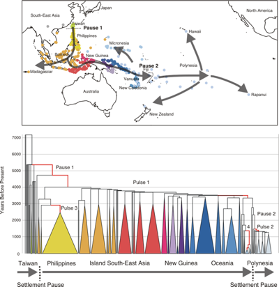
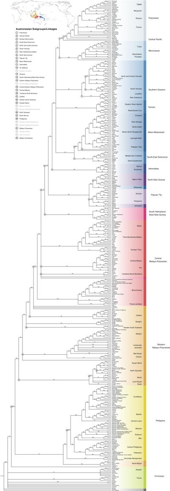
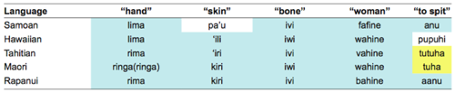
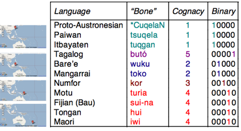

# About the ABVD

Data in the Austronesian Basic Vocabulary Database was collected to help shed light on the population history of the Pacific. The first
major result of this line of research was Gray et al.'s 2009 paper [Language Phylogenies Reveal Expansion Pulses and Pauses in Pacific Settlement](https://doi.org/10.1126/science.1166858).

# Our Research:

Questions about human origins have an enduring fascination (e.g. where did the Polynesians come from?). Languages, like genes, are archives of history. They provide vital evidence to help unravel the mysteries of our past. Recently there have been huge advances in the computational methods used to make inferences from genetic data.

Languages evolve in remarkably similar ways to biological species. They split into new languages, mutate, and sometimes go extinct. However, despite these parallels linguists have not commonly used the phylogenetic methods that have revolutionised evolutionary biology in the last twenty years.

The Austronesian language family is one of the largest in the world, and one of the most widely dispersed, with around 1,200 languages spoken in the area between Madagascar, Taiwan, Hawaii, Easter Island and Aotearoa/New Zealand. Our research uses phylogenetic methods to test hypotheses about the expansion of the Austronesian language family and the settlement of the Pacific. By placing genetic and linguistic evidence in a common methodological framework we hope to be able to make more powerful inferences about our past.

## What we did

We analysed basic vocabulary from 400 languages in this database using computational phylogenetic methods to build a set of "family" trees for the languages of the Pacific.

The results clearly show that the origin of the entire Austronesian language family can be dated back to Taiwan around 5,200 years ago, and moved through Island South-East Asia, along New Guinea and into Polynesia.

We show that peopling of the Pacific proceeded through a series of expansion pulses and settlement pauses. We can link these pulses to the development of new technology - better canoes, farming, social techniques to deal with the inter-island distances in Polynesia etc.

<figure>
  
  <figcaption>
    
Map of the Pacific and the Language “family tree” showing the settlement of the Pacific by the Austronesian peoples. Pauses occurred before the settlement of the Philippines and before the settlement of Western Polynesia. Rapid expansion pulses occurred through the Philippines, along the New Guinea coast, in Micronesia and in Polynesia.

    
<a href="Gray_et_al2009-large.tif">Higher resolution version of figure (400kb)</a>

</figcaption>
</figure>

<figure>
  
  <figcaption>
    
Full Tree Figure of Austronesian languages.

    
<a href="FullTreeFigure.pdf">Higher resolution version of figure (1.5mb)</a>

</figcaption>
</figure>

## How does it work?

### 1. Collect Data:

To be able to accurately test hypotheses about prehistory, we needed a large amount of data. We collected this data over a period of six years from a number of sources:

1. Wordlists collected by linguists during fieldwork. The major providers have been Robert Blust, John Lynch, and Malcolm Ross. Many other linguists have graciously contributed word lists for languages they are familiar with.

2. Published wordlists and dictionaries, including the Polynesian Lexicon project POLLEX (Biggs and Clark 2000), and a large collection of Micronesian reconstructions (Bender et al. 2003a, 2003b).

3. Native speakers who have contributed word lists for their languages through the web interface

See the [Austronesian Basic Vocabulary Database Authors Page](../../CONTRIBUTORS.md) for a full contributor list, and see [our paper on the database](https://doi.org/10.4137/ebo.s893) too.

### 2. Group the entries into cognate sets:

To identify the relationships between languages we used the [Linguistic comparative method](http://en.wikipedia.org/wiki/Comparative_linguistics). This method commonly takes a sample of lexicon and proceeds to reconstruct systematic sound correspondences between the languages in order to uncover historically related "cognate" forms. These correspondences can be used to identify the words (and hence the languages) that have descended from a common ancestor.

In the table below, the entries for "hand" show a common "l" to "r" sound shift. This is also seen in the entries for "skin", with a systematic correspondence between Hawaiian’s "l" and Tahitian/Maori/Rapanui’s "r".

Another systematic correspondence can be seen in the entries for "bone" and "woman". These correspondences can be used to identify the words (and hence the languages) that have descended from a common ancestor. In this case, the forms colored in light blue share a common ancestor.

In the entries for "to spit", there are two cognate sets - the first "anu/aanu" is present in Samoan and Rapanui and descends from the ancestral Nuclear Polynesian form *anu, whilst the second "tuhu/tutuha" is an innovation in the East Polynesian languages of Tahitian and Maori.

<figure>
  
  <figcaption>Table of Polynesian languages with the cognate words color-coded.</figcaption>
</figure>

These cognate judgements were done by or in consultation with a number of linguistic experts including Robert Blust (Professor of Linguistics, University of Hawai'i at Manoa), Jeff Marck (Research Associate, Australian National University), John Lynch (Professor of Pacific Languages and Director of the Pacific Languages Unit at the University of South Pacific), Laurent Sagart (Senior Scientist, Centre National de la Recherche Scientifique), Malcolm Ross (Professor of Linguistics, Australian National University), and ourselves.

### 3. Convert the cognate sets into a binary matrix:

To analyse these cognate sets we code them as binary characters showing the presence or absence of the cognate set in each language.

<figure>
  
  <figcaption>Words meaning "bone" in a number of Austronesian languages, showing the language, cognate set, and binary coding.</figcaption>
</figure>

### 4. Analyse the Data:

The methods we used here are known as Bayesian phylogenetic methods. These are the tools used by modern evolutionary biology to build family trees based on DNA sequences.

In this framework the analysis aims to find the set of most probable trees given the data and a stochastic model of lexical evolution. Our model allows for different rates of change between cognate sets where some items can evolve faster than others at different places on the tree.

### 5. Dating the trees:

We can date the trees we found using phylogenetic dating methods. The trees we found in the search above have branches proportional to the amount of change along that lineage. These branch lengths can be converted to time by adding calibration points. For example, the Eastern Polynesian subgroup can be constrained to around 1,200 to 1,300 years ago on the basis of initial settlement times. Similarly, the Chamic subgroup can also be calibrated based on the fact that Chamic speakers were mentioned in Chinese records around 1,800 years ago, and probably entered Vietnam around 2,600 years ago.

These calibrations allow the method to estimate how fast the changes measured by the branch lengths are occurring. We can then convert the branche lengths into time estimates by "smoothing" the rates of change across the tree. Instead of assuming a constant retention rate, this allows certain parts of the tree to change faster or slower than others.

## Frequently Asked Questions

### 1. What are the methodological innovations compared to your study published in Nature in 2000

The pulse/pause model makes four key predictions about the origin, age, sequence, and timing of pulses and pauses in the Austronesian expansion. In [the 2000 paper](https://doi.org/10.1038/35016575) we only tested the prediction about the sequence.

We are able to test the other three predictions in this current paper because of four methodological advances.

1. In this paper we base our analyses on a very large database on basic vocabulary we have constructed (over 34,000 cognate sets for 400 languages). The sampling of languages and vocab in the 2000 paper was patchy. This meant that we couldn't get accurate branch length estimates and hence couldn't date the trees.

2. We test the Taiwanese origin by using some outgroups to root the trees. The 2000 paper just rooted the tree in Taiwan (assuming a Taiwanese origin).

3. We use Bayesian phylogenetic methods rather than a parsimony approach to build the trees. This means that we can explicitly incorporate the uncertainty in our estimates of the trees and their branch lengths into our analyses.

4. Most significantly, in this paper we date the trees. This means we can test the key predictions about the age of Austronesian and the timing of the expansion pulses and pauses.

### 2. Is this [lexicostatistics](http://en.wikipedia.org/wiki/Lexicostatistics)?

No. Lexicostatistics calculates pairwise cognate similarity measures between languages to link them into subgroups. Our methods calculate the likelihood of each cognate set in a series of trees in a search to find the set of most probable trees. So both the data analysed and the statistical analyses are fundamentally different.

For more information on how phylogenetic methods work, see the [Wikipedia page](http://en.wikipedia.org/wiki/Computational_phylogenetics).

### 3. Are your date estimates based on [glottochronology](http://en.wikipedia.org/wiki/Glottochronology)?

No. Our methods do not assume a single constant rate of change over time. Instead, we use a method ("Penalised Likelihood Rate Smoothing") that allows us to "smooth" the observed rates of change across the trees whilst taking into account historical information as "calibration points". This allows certain languages and subgroups to change at different rates over time. In addition, since we calculated these age estimates across a distribution of trees, we have a confidence interval around each age estimate.

### 4. Languages borrow from each other - how would this have affected your results?

In our database we have a lot of loan words identified. We removed these from the analysis. In addition, we avoided using languages that are known to be creoles or have "hybrid" histories.

More importantly, our methods are actually very robust to borrowing between languages (we are working on a study showing this at the moment), and even reasonably high levels of borrowing are unlikely to have substantially biased our results.

### 5. Wasn't everybody already convinced that the Wallacean-origin model was wrong?

It depends who you talk to. Amongst linguists and archaeologists it has few proponents but it is taken very seriously by many geneticists.

### 6. What about Thor Heyerdahl's theory that the Polynesians came from South America?

There is no evidence that the Polynesians originated in the Americas, and most modern researchers consider this very unlikely. Instead, the genetic, linguistic, and archaeological evidence all point towards an origin in Taiwan.

### 7. 400 languages, 34,000 cognate sets... that's pretty big, isn't it?

It is. Most mitchondrial genomics work is done on data of around 16,000 base pairs, and usually not over 400 species either!

Thanks to Mark Pagel and Andrew Meade we were lucky enough to have access to a large computer cluster at the Centre for Advanced Computing and Emerging Technologies (ACET) at the University of Reading.

All up, the analyses we did here took over a month and a half distributed on this cluster of 150 nodes.
